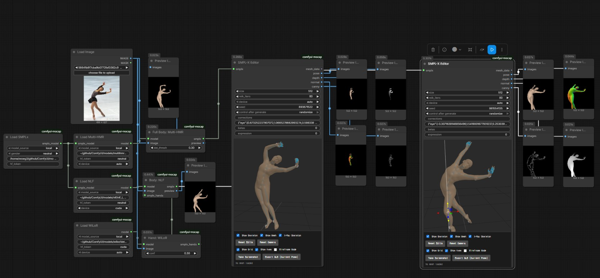

# ComfyUI-SMPLx Estimator

[](https://github.com/ameliacode/ComfyUI-SMPLx-Estimator/stargazers)
[](#license)
[](https://www.python.org/)

Single-image **SMPL-X** estimation for ComfyUI — recover an expressive whole-body
model from one photo, refine it in an interactive 3D editor, and export ControlNet
maps or a mesh. Bring your own estimator: **NLF** (robust body), **Multi-HMR**
(expressive whole-body), and **WiLoR** (dedicated hands).




```
Load SMPLx ─smplx_model─┬─► Load NLF ─model─► Body: NLF ─┐
                        └─► Load Multi-HMR ─model─► Full Body: Multi-HMR ─┤
Load WiLoR ─model─► Hand: WiLoR ──(smplx_hands)──► Body: NLF               │
                                                                         ▼
                                         SMPL-X Editor ─mesh_data─► Export Mesh
                                         └─► pose / depth / normal / canny
```

## Nodes

| Node | Description |
|---|---|
| **Load SMPLx** | Loads the SMPL-X body model (`local` folder or `huggingface`) → `smplx_model`. |
| **Load NLF** | Loads the NLF estimator → `model`. |
| **Load Multi-HMR** | Loads the Multi-HMR estimator → `model`. |
| **Load WiLoR** | Loads the WiLoR hand model + detector → `model`. |
| **Body: NLF** | Robust single-image body → SMPL-X (neutral shape, flat hands). Optional `smplx_hands`. |
| **Full Body: Multi-HMR** | One-pass expressive whole-body SMPL-X (body + hands + face). |
| **Hand: WiLoR** | In-the-wild hand reconstruction → SMPL-X hand pose (feeds `smplx_hands`). |
| **SMPL-X Editor** | Interactive 3D editor: drag body/finger joints (IK), edit betas/expression, render `pose`/`depth`/`normal`/`canny` from the viewport. Outputs `mesh_data`. |
| **Export Mesh** | Writes `mesh_data` to `obj` / `ply` / `glb` in the output folder → `file_path`. |

## Installation

### ComfyUI Manager (recommended)

1. Open **ComfyUI Manager**
2. Search for `SMPLx Estimator`
3. Click **Install**, then restart ComfyUI

### Manual

```bash
cd ComfyUI/custom_nodes
git clone https://github.com/ameliacode/ComfyUI-SMPLx-Estimator.git
cd ComfyUI-SMPLx-Estimator
pip install -r requirements.txt
python install.py
```

Restart ComfyUI after installation.

## Models & weights

Weights are **not bundled** (size + licensing). Download what you need and place it
under `ComfyUI/models/<folder>/`. The loaders auto-resolve from there (`model_source = local`),
or fetch from a HuggingFace repo (`model_source = huggingface`, with an optional `hf_token`).

| Model | File(s) | Place in | License | Source |
|---|---|---|---|---|
| **SMPL-X** *(required)* | `SMPLX_NEUTRAL.npz` (+ `MALE`/`FEMALE`) | `models/smplx/` | MPI — **registration** | [smpl-x.is.tue.mpg.de](https://smpl-x.is.tue.mpg.de/) |
| **NLF** | `nlf_l_multi_0.3.2.torchscript` | `models/nlf/` | CC-BY-NC | [isarandi/nlf](https://github.com/isarandi/nlf/releases) |
| **Multi-HMR** | `multiHMR_896_L.pt` | `models/multihmr/` | NAVER non-commercial | [naver/multi-hmr](https://github.com/naver/multi-hmr) (accept license) |
| **WiLoR** | `wilor_final.ckpt`, `detector.pt` | `models/wilor/` | CC-BY-NC-ND | [WiLoR on HuggingFace](https://huggingface.co/spaces/rolpotamias/WiLoR) |
| **MANO** *(for WiLoR)* | `MANO_LEFT.pkl`, `MANO_RIGHT.pkl` | `<node>/vendor/WiLoR/mano_data/` | MPI — **registration** | [mano.is.tue.mpg.de](https://mano.is.tue.mpg.de/) |

> **SMPL-X and MANO are registration-walled** and cannot be auto-downloaded — register, then
> place the files manually. The loaders raise a clear message pointing you here if a file is missing.

## Usage

1. Add **Load SMPLx** (defaults to `models/smplx/`). Connect its `smplx_model` output.
2. Add an estimator loader + estimator:
   - **Load NLF → Body: NLF** for robust body/global pose (GPU-only), or
   - **Load Multi-HMR → Full Body: Multi-HMR** for body + hands + expression in one pass (runs on CPU too).
3. *(Optional, for sharp hands with NLF)* **Load WiLoR → Hand: WiLoR**, and wire its output into **Body: NLF**'s `smplx_hands`.
4. Feed the estimator's `smplx` into the **SMPL-X Editor**:
   - Drag body / finger joints (IK re-solves), edit `betas` (shape) and `expression`.
   - Orbit the camera — the `pose`/`depth`/`normal`/`canny` outputs render from that viewpoint (ControlNet-ready).
5. Connect the editor's `mesh_data` to **Export Mesh** to save an `.obj` / `.ply` / `.glb`.

> **Quick start:** drag [`example_workflows/smplx_multihmr_example.json`](example_workflows/smplx_multihmr_example.json)
> into ComfyUI, drop in your own image (replace `example.png`), and Queue.

## License

Wrapper code is **MIT** ([LICENSE](LICENSE)). The vendored estimators and model weights keep their
own **non-commercial** licenses (see the [Models & weights](#models--weights) table), so the package
and its outputs are for **research / non-commercial use only**. Please cite and comply with each original.

## Attribution

This package vendors third-party estimator source (cloned into `vendor/` by `install.py`) and loads
third-party weights, each under its own license:

- **Multi-HMR** — NAVER Corp. · CC BY-NC-SA 4.0 · [repo](https://github.com/naver/multi-hmr) · *Multi-HMR* (ECCV 2024)
- **WiLoR** — Potamias et al. · CC BY-NC-ND 4.0 (no derivatives) · [repo](https://github.com/rolpotamias/WiLoR) · *WiLoR* (2024)
- **NLF** — Sárándi & Pons-Moll · CC BY-NC 4.0 · [repo](https://github.com/isarandi/nlf) · *Neural Localizer Fields* (NeurIPS 2024)
- **SMPL-X / MANO** — Max Planck Institute — registration-walled · [smpl-x](https://smpl-x.is.tue.mpg.de/) · [mano](https://mano.is.tue.mpg.de/)

## Acknowledgements

- 3D viewer based on [comfy-3d-viewers](https://github.com/PozzettiAndrea/comfy-3d-viewers); editor UI inspired by [ComfyUI-SAM3DBody](https://github.com/PozzettiAndrea/ComfyUI-SAM3DBody)
- Thanks to the model authors above for sharing their work with the research community.
